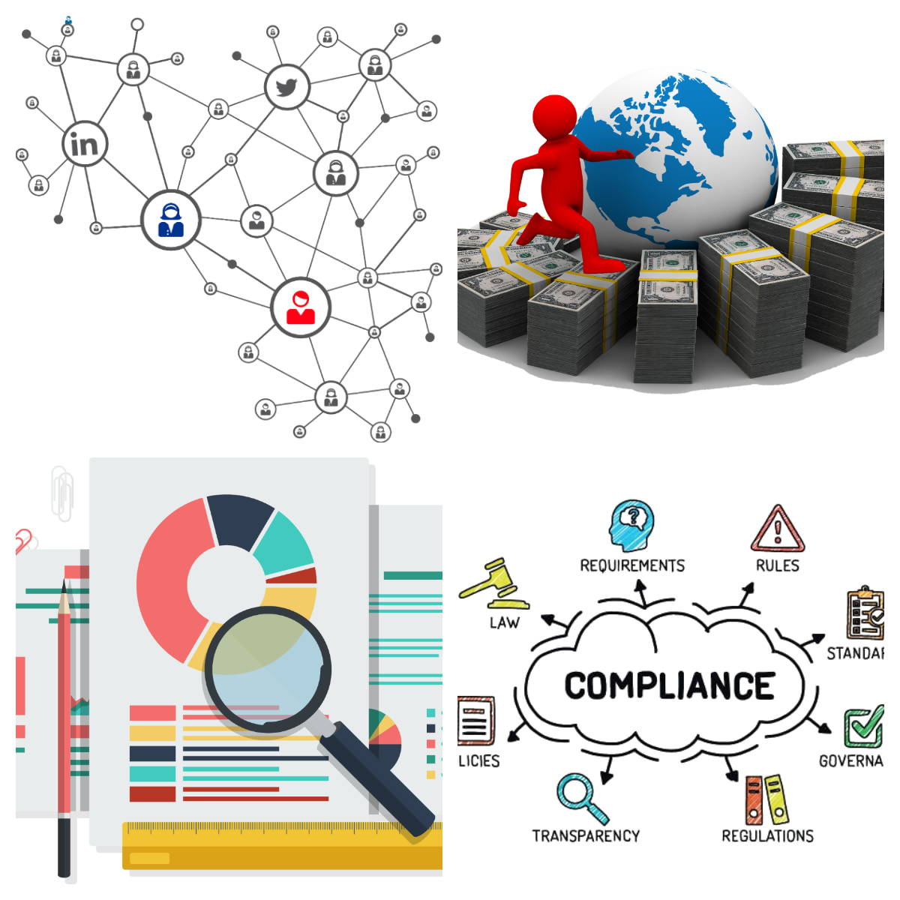

# Tokenization of private equity 

Our platform allows any investor to participate in Private Equity funds that are generally illiquid and offered to the ultra wealthy and corporations. Where funds will be raised through a crowd sale and then traded in the secondary market with a lock-in period of 10 years. Once money is raised, the fund will then seed startups primarily in the High-Tech sector.

- Private Equity funds can now raise funds through the creation of their own initial coin offering/security token offering 
- Market creation after the funds are raise is generated for investors to sell and buy their coins in the fund
- Fund strategy expected returns are generated using statistical techniques such as ARIMA and ARMA  

#### What is Tokenization?
  is the process of issuing blockchain token (also known as A security token) that digitally represents a reall tradable asset. These security tokens are created throught a security token offering (STO) 
  
 #### what is Security Token Offering (STO)?
  A security token offering (STO)/tokenized IPO is a type of public offering in which tokenized digital securities, known as security tokens, are sold in cryptocurrency exchanges. Tokens can be used to trade real financial assets such as equities and fixed income, and use a blockchain virtual ledger system to store and validate token transactions.

## Advantages 
Our token will offers the potential for a more efficient and fair financial world by greatly reducing the friction involved in the creation, buying and selling of securities. some key advantages that tokenization provides for both investors and sellers:
  - Liquidity : Tokens can be traded on secondary markets which will access to a broader base of traders that will increases liquidity. 
  - Rapid settlement and Cost effective transactions: The transaction of token is completed with smart contracts, certain parts of the exchange process are automated. this automation can reduce the administrative cost.                                                      
  - Transparency:  Tokens will have the token-holder’s right and legal responsibilities embedded directly onto the token, along with an immutable record of ownership.
  - Compliance enforcement: Programs legal obligations into digital assets to ensure only eligible parties participate.

   
   - Digital shares.
   - 24/7 Market.
   
   

## Technologies

### Solidity for minting tokens, defining token behavior, and smart contracts

                       

### Python SciKit LSTM machine learning models for token price forecasting 

### Ganache for ethereum account / wallet creation 
### Metamask for simulating trades + payouts